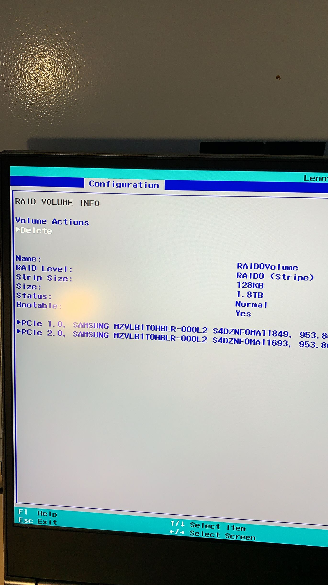

# 联想 Y9000X（顶配）使用情况

> fixme: 暂未完成，未链接的图片请到 '/imgs' 文件夹下查看
>
> tip: 此文基本为个人体验，一点都不专业。
> 内含部分：品控、软件测试、双系统安装、编译测试

// todo: 这里应该有一堆图片

这款电脑最吸引我的地方就是拿来写代码很爽

到手后，第一时间拆掉了 Raid0，一个盘装Ubuntu 19.x，另一个盘装 Windows 10 专业版。

因为Windows很玄学的原因，我至今没在Windows上编译成功过大部分项目（比如Node.js、Deno、V8等“前端”圈项目，特别是谷歌的GYP十分难用，真屑）所以另装 Ubuntu。

## 品控

品控相当于抽奖，记得我当初买Surface Pro 5 顶配时候就出现了两处亮点，很让人难过

这台机子到手后，目前还没有出现什么硬件问题，键盘、屏幕的品控都可以，唯一的问题就是，电源键的里面黑圈比外面的小一点点，看图的右下角边缘

但是我自己代表不了全体，希望你们多看看别人到手后是什么情况再判断品控如何

## 散热情况

100%CPU跑满下风扇情况看视频

此时键盘是不会有烫手的，但是电源键那一块黑长条部分是很烫的（包括电源键），基本就是摸灌了热开水的农夫山泉的感觉

## 工作环境

Filco 圣手87键2代红轴键盘侧刻、Sony WH-1000XM3降噪耳机、Logitech G703无线鼠标

配着4K屏幕写代码，感觉很爽

而且开着降噪，就算风扇跑得再厉害我也听不见（逃

## 使用软件

Windows下：

- JetBrains 系列
- Visual Studio Code
- Visual Studio
- Steam
- Chrome
- Office 365
- iTunes

Windows 下，除了古老的软件外，目前应该都支持高分屏了

印象中唯一不支持的就是网易的魔兽对战平台（逃

虽然是生产力电脑，但是游戏还是要耍一下的，而且我玩的游戏都不是显卡大户，几个游戏测试下来

- 群星（分辨率最大，画质最低）18-25 FPS

- Rimworld （全高画质）35-40FPS

- CSGO（全低特效，1920*1080）80-120FPS

---

Ubuntu下：

- JetBrains 系列
- Visual Studio Code
- Steam
- 命令行软件

Ubuntu 下目前没见到过不支持高分屏的软件，跑代码来说是很舒服的

## 双系统教程

1. 整好 Windows 10 和 Ubuntu 的安装U盘
2. 关闭Raid0
   1. 开机按下F2
   2. Configuration --> Storage中，控制器模式改成AHCI，下面的RAID阵列设置里，按下Delete

   3. 保存重启
2. 插入 Windows 10 U盘
   1. 一路狂点下一步，选择你需要安装的系统（专业版 or 家庭版），然后安装磁盘里面选第一个磁盘即可
3. 开机，Windows 10 部分安装完成，若没有激活的请使用 [此激活工具](https://github.com/TGSAN/CMWTAT_Digital_Edition)
4. 开始 -- 设置 -- 更新和安全 -- 激活 -- 高级重启
   1. 此时插入 Ubuntu 安装U盘
   2. 一路点击下一步，安装类型选择 "其他选项"
   3. 分区如图，记住是第二个盘，别动Windows那个盘

5. 完成

Ubuntu 19.x 目前问题：声卡有问题，外放和蓝牙耳机都没有声音

## 其他问题

- Windows HD Color 打开后，有时候屏幕会特别的暗，不知道什么情况

